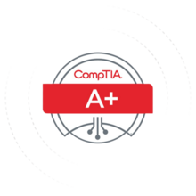
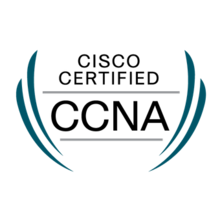
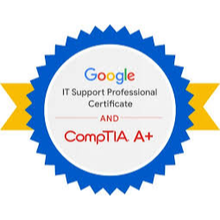
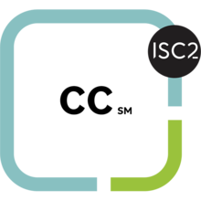

# Hi, I'm Glenn P. Gawron 👋

**IT Professional | Networking | Cybersecurity | IT Support**  
San Diego, California

---

## 🛠️ About Me
Passionate and certified IT professional with proven knowledge in hardware/software troubleshooting, networking, and cybersecurity fundamentals. Recently completed ISC² Certified in Cybersecurity (CC) domains and actively building hands-on experience to deliver reliable, secure technology solutions.

- **Current focus**: Cybersecurity fundamentals, incident response, network infrastructure, and IT support operations.
- **Location**: San Diego, CA
- **Open to**: IT Support, Help Desk, Network Technician, Junior SOC Analyst, or Cybersecurity roles.

---
## 🏆 Certifications

<table>
  <tr>
    <td align="center"> 
      <strong>CompTIA A+</strong> 
      Issued: 07 Feb 2002 
      <a href="https://verify.comptia.org">Verify (Code: MHFWR28N0K1Q1ZSV)</a>
    </td>
    <td align="center"> <strong>Cisco CCNA Routing & Switching</strong> 
      Issued: 29 Nov 2012 <a href="https://www.credly.com/earner/earned/badge/bb366bdd-731e-4754-8bb3-48a6bed1ad90>🔗 Verify on Credly</a>
    <td>
  </tr>
  <tr>
    <td align="center"> 
      <strong>Google IT Support Professional Certificate</strong> 
      Issued: 13 Jan 2020 
      <a href="https://www.credly.com/earner/earned/badge/98ad5d43-70c0-4e4a-b156-036fa620aa2e">🔗 Verify on Credly</a>
    </td>
    <td align="center"> 
      <strong>ISC² Certified in Cybersecurity (CC)</strong> 
      Issued: 12 Feb 2026 
      <a href="https://www.credly.com/badges/b1fe11bc-8120-40f3-8439-03b0f79b85bc">🔗 Verify on Credly</a>
    </td>
  </tr>
</table>

---

## 🧠 Skills & Technologies
- **Networking**: TCP/IP, routing & switching, VLANs, Cisco IOS (CCNA level)
- **IT Support**: Hardware diagnostics, OS installation, troubleshooting (CompTIA A+ & Google IT)
- **Cybersecurity**: Security principles, incident response, business continuity, disaster recovery (ISC² CC)
- **Tools**: Wireshark, basic Linux/Windows CLI, ticketing systems, SIEM fundamentals
- **Soft skills**: Clear communication, problem-solving, customer-focused support

---

## 📬 Let's Connect
- **LinkedIn**: https://www.linkedin.com/in/glennpaulgawron/
- **Email**: glenn.paul.gawron@gmail.com

---

*Always learning — currently strengthening cybersecurity and cloud skills. Feel free to reach out!*
